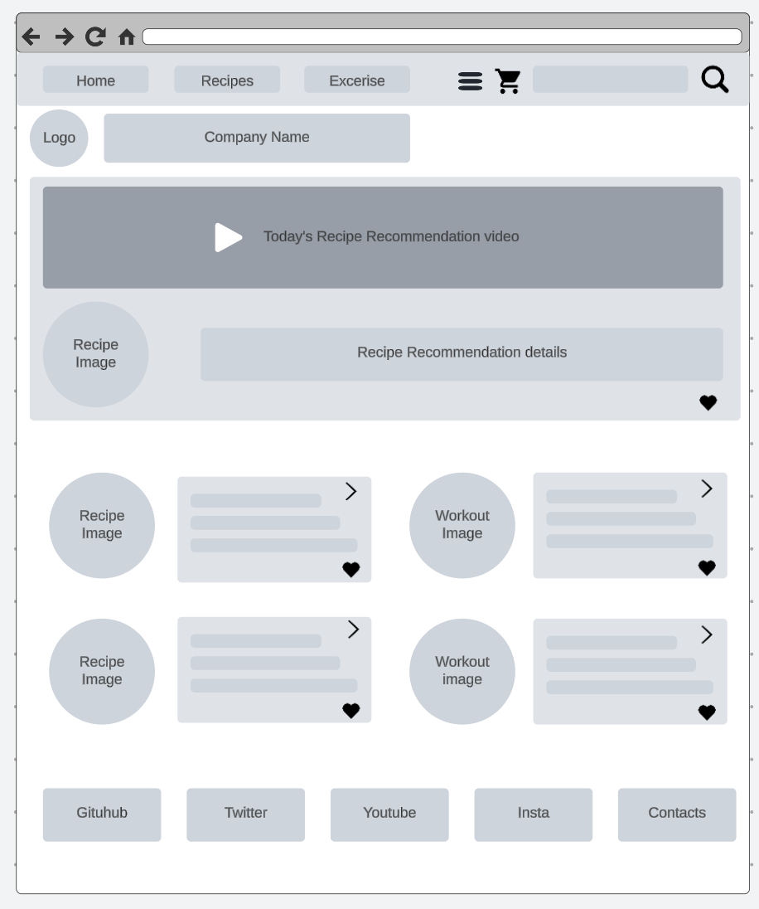
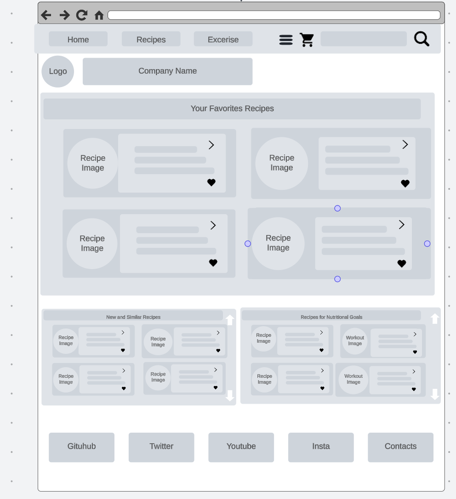
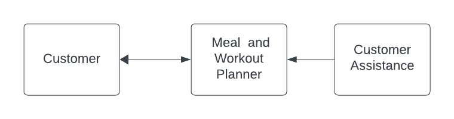
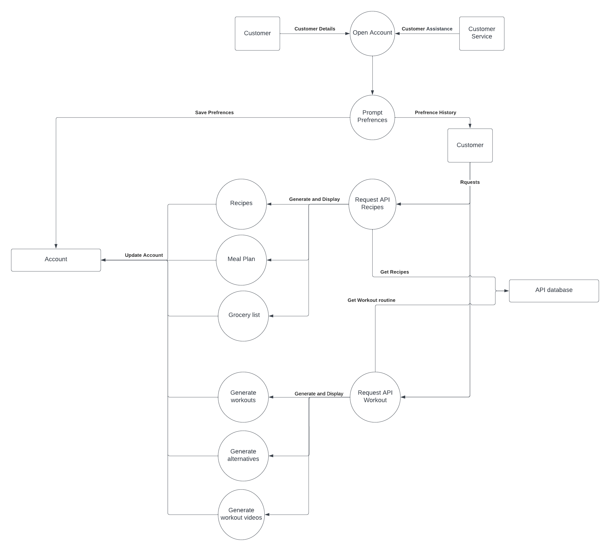

# Report Draft

## Nam : Overview of the project
Our project is a software application that provides users a way to balance out their dietary and physical lifestyle. By combining two key API's: the Tasty API and Exercises API users will have access to a variety of health and lifestyle choices for everyone to benefit from. The Tasty API allos users to display recipes, generate meal plans, create grocery lists, and educational nutrition facts. Saving the time and energy that would have been otherwise wasted on planning and research. Complementing that is the Exercise API which will generate workout plans, provide alternatives to pre-existing workout plans and deliver informative demonstration videos. Given that our diets and physical health are closely intertwined, leveraging both APIs together is a great opportunity to streamline and create convenience for the average user. Pairing the Tasty and Exercises API’s together supplies users with detailed diets to meet their workout needs and vice versa. Creating a balance and convenience for users' physical health, dietery needs and overall lifestyle.

## Ryan : Outline which SDLC model was chosen and why
For our project, we decided to use the Kanban SDLC. We chose this due to the issue with times when we can meet up. Some of us have schedules that do not remain consistent, so setting up dates to meet up can be difficult. Since we are a small team and our project is not super complex, we can use Kanban as it allows us more flexibility to work around our schedules. We also felt that due to the constraints of our schedules, this SDLC would provide us with the best efficiency for our project. It will also provide us with a better understanding of our group’s project progress, so we do not overstress ourselves without busy schedules. As this is our first time working with each other, it will also help with communication in cases such as someone spending a long time on a task and not asking for help.

## John :  2 User stories per each API (4 total, 1 mark each)

**Tasty API**

> Say hello to Jeremy, a college student!

- *Age*: 20
- *Education*: Bachelor's degree in Computer Science (in-progress)
- *Occupation*: Part-time Cashier at Save-on-Foods
- *Background*: 
  - Lives in Burnaby and takes an hour commute to school
  - Works 20 hours per week on average; and a 30 minute commute
  - Is a full time student at a local college
- *Characteristics*:
  - Typically spends money on food during his school week
  - Enjoys exploring new cuisines
  - Spends time at school until the evening to eat dinner
- *Goals*:
  - Wants to decrease spending money on restaurants
  - Aiming to buy his own groceries and cook more to be more independant
  - Wants to explore healthier options and put his cooking skills to the test
- *Challenges*:
  - Cannot have home cooked food since he stays after school to study
  - Between work and school he has no time to actively look for what to eat
  - Has time on Sundays and Wednesdays for leisure
- *Behaviors*:
  - Eats fast food for lunch at school and at work
  - Spends Saturday nights as dedicated outing with friends or family
- *Quotes and Motivations*:
  - Quote: "This is the third time I have ate Timmies this week"
  - Motivation: "Health, budget benefits, independance"

> Say hello to Anjela, a busy business woman!
(note she can use this app on the way to work to plan her meals and groceries)
- *Age*: 42
- *Education*: Bachelor's degree in Business Administration
- *Occupation*: Marketing Manager at a local firm
- *Background*: 
  - Lives in Mount Pleasent and takes a a short commute to work
  - Works an average of 50 hours per week
  - Juggles work commitments, social interactions, and personal errands
- *Characteristics*:
  - Relies on takeout meals to get through the week
  - Prefers convenience and efficiency when it comes to cooking and eating
  - Struggles with budgeting her food bills per each month
- *Goals*:
  - Aims to meal prep in advance to save time and money
  - Wants to improve her budgeting skills and reduce spending on takeout  
  - Is seeking to adopt a healhtier diet and lifestyle
- *Challenges*:
  - Limited time for meal planning and cooking during the work week
  - Prefers not to cook everyday but still have variety in her meals
  - Available time for meal prep mainly on Sundays due to her hectic schedule 
- *Behaviors*:
  - Frequently orders takeout for lunch and dinner on busy workdays
  - Indulges in unhealthy food choices when she is stressed 
  - Values convenience but is open to making positive changes for her health and finances 
- *Quotes and Motivations*:
  - Quote: "I spent too much this month on takeout, but I just don't have time to cook"
  - Motivation: "I want to eat better, save money, and feel in control of my financees and health"

**Exercise API**
  > This is Sarah, a local hospital!

- *Age*: 36
- *Education*: Bachelor's of Science in Nursing
- *Occupation*: Nurse at a nurse at VGH
- *Background*: 
  - Lives in Richmond with her husband and two young children
  - Works long shifts at the hospital, in a high-stress environment
  - Strives to find balance between her family responsibilities, career, and health goals 
- *Characteristics*:
  - Is determined and motivated to get the job done
  - Compassionate and resilient, she does well in fast-paced and high-stress environments, but struggles to find the time for self-care
  - Values efficiency and practicality in all aspects of her life
- *Goals*:
  - Striving to improve her physical fitness and endurace to help her in every day life
  - Seeks guidance on balancing fitness goals with responsibilities as a nurse and a mother
  - Aiming to implement exercising on a regular bases to help manage stress and boost energy levels 
- *Challenges*:
  - Limited time for structured workout routines due to long shifts and irregular work hours
  - Difficulty keeping consistent with routines in the past due to time constraints
  - Needs workouts that can be done within an hour and a few home workouts
- *Behaviors*:
  - Motivated to make positive changes in her life but needs help in formatting a workout plan
  - Values convenience as she has many commitments
  - Prioritizes self-care and health as she has a busy lifestyle
- *Quotes and Motivations*:
  - Quote: "I understand how important exercising is, but finding the right workout plan is difficult"
  - Motivation: "I want to set a positive example for my children and prioritize my long term health"
    > This is Sarah, a local hospital!

- *Age*: 46
- *Education*: Trade Certification in Electrical Installation
- *Occupation* Electrician at a local company
- *Background*: 
  - Lives in the suburban area of Langley with his wife and their three teenage songs
  - Works as a full-time electrician
  - Juggles his physically demanding job and parenting three active teenage boys
- *Characteristics*:
  - Skilled, detail-oriented and excels in the technical part of electrical work
  - Takes pride in his work and is known for problem-solving skills and ability to understand complex electrical issues
  - Struggles to find time for dedicated exercise as 
- *Goals*:
  - Aims to improve physical fitess and maintain his overall health
  - Used to weight lift back in the day, but now wants to train for a functionality to prevent injuries
  - Striving to get rid of his "dad bod"
- *Challenges*:
  - He lacks motivation due to not knowning how to train, but will train if he knew
  - Needs a flexiblity in the schedule as he tends to pick up over time hours and take his sons to games
  - He does not enjoy aerobic exercises
- *Behaviors*:
  - Most of his day to day physical activity is at his workplace
  - Is a supportive parent and husband, he spends a lot of time with family
  - Values practicailty in all aspects of life
- *Quotes and Motivations*:
  - Quote: "I need to shrink this tummy of mine"
  - Motivation: "Exercise will help me to sustain this line of work for many years to come"

## Rain Outline your technology stack and why you chose it
We chose HTML and JavaScript, including Bootstrap, for our project's tech stack because they're versatile and easy to use for creating interactive web apps. JavaScript enables dynamic features and real-time updates without page reloads. Plus, JavaScript libraries save time and effort, helping us build a project that can adapt to users' changing needs and new technologies.

## Rain Initiated GitHub project 

(# 2350_project

# Please add your name on the list

john
Ryan
Nam 
Rain

# setup steps:
# clone the project from "git@github.com:RainZhao01/2350_project.git"

# 1. cd into project directory

# 2. create your branch

# 3. Setup upstream:
# git push --set-upstream origin

# 4. try to pull someone most recent branch repo that contain our updated name.(first person should pull from Rain's branch, do not pull from master yet. When you click on 'branches' on the GitHub website, it will display which branch is the most recent updates.")

# 5. modify the readMe file

# 6. git add . , git commit and git push

# additional information:
# when pull the repository:
# git pull origin <your branch name>
# when push the repository:
# git push origin <your branch name>)

## John List of chosen APIs and why you chose them
We chose the Tasty API because it meets our requirements of the features that our application offers. The Tasty API allows us to generate recipes and nutritional facts. Based off of those, we will be able to manipulate that data into a readable format for the user. Tasty also has a large database of recipes, ensuring we meet the needs of the wide population while taking account of different dietary restrictions. The nutritional values from the generated recipes is what our feature two needs; Which is to calculate the calories and macros to achieve a balanced diet and weight goals. As for the third, the app will compare the recipe's ingredients to the user's.
The Exercise API was chosen for similar reasons as it goes hand in hand with the Tasty API, and has a large database. Lining up the goals for the user will generate a dedicated workout plan tailored to different users and their goals, so that a middle aged woman and a young man have different workouts. 

## Ryan Planned features per each API (in detail - 3 features per each API, 6 features minimum)

Tasty Api:

Feature #1
This feature is generating recipes for the user. There will be options such as dietary restrictions, cooking levels, and calories. The dietary restrictions input will help users pick food that they can eat without issue. The cooking level input will help the users pick recipes that they can cook. The cooking level may be inaccurate as we are basing the difficulty on length. The calories will aid users meet their dietary needs.

Feature #2:
Our second feature is like our first, however, instead of a single recipe we are providing an entire meal plan. This meal plan can be for a single day or multiple days. Although you could use the first feature multiple times to make a meal plan, our second feature will serve as a better visualization of what the user is consuming. This is because when a user picks out 3 different meals using the first feature, it will not be tailored to their nutritional goal.

Feature #3:
This feature is similar to the first feature but focuses on what the user currently owns. This feature will be linked to the user’s account. It will be a list of groceries that the user currently owns and will search the Tasty Api for food that they can currently make.

Exercise Api:

Feature #1:
This feature will create a workout plan for the user. This feature will be based on the user's experience and workout goals. The user will also be able to choose which muscle groups and the type of workout they want to do.

Feature #2:
This feature will allow users to change their preexisting workouts. They will be able to choose a workout they currently have and swap it out for an alternative workout that focuses on the same part of the body.

Feature #3:
Our final feature will allow the user to search for an exercise from the Exercise API and will be provided with a video to the user to explain it.

## Ryan Work breakdown structure (WBS) including how the work was divided up and who has completed what element (including the actual report and presentation components)

The task are not divided up due to our choice of the Kanban SDLC.

## Ryan Project schedule/timeline

## Nam & John : Wireframes and prototype elements for the application interface

Wireframe for main pages: 

Home page: 

Recipes Page: 

Exercise Page:

## Nam 2 Data flow diagrams (high level/overview - Level 0, another with details - Level 1) (3 marks each)

Data Flow Diagram - Level 0:

Data Flow Diagram - Level 1:

